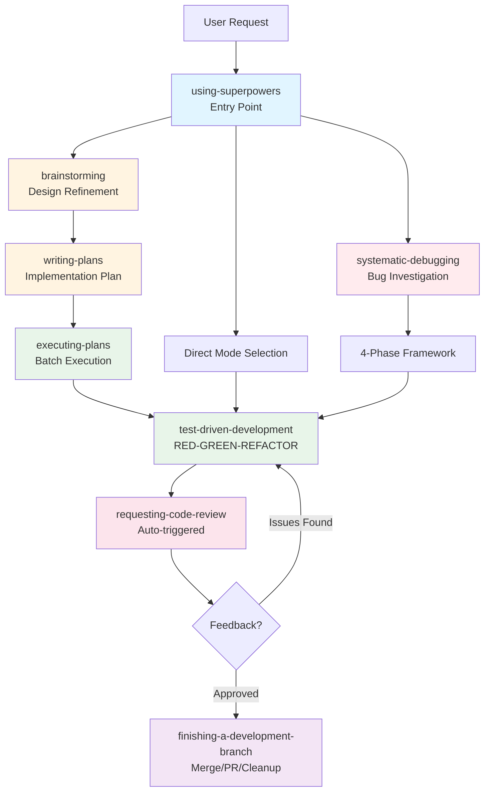
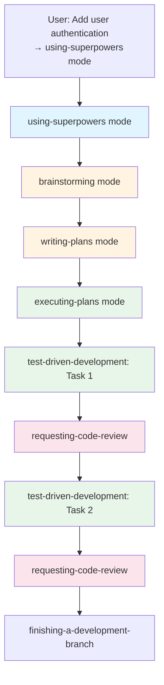
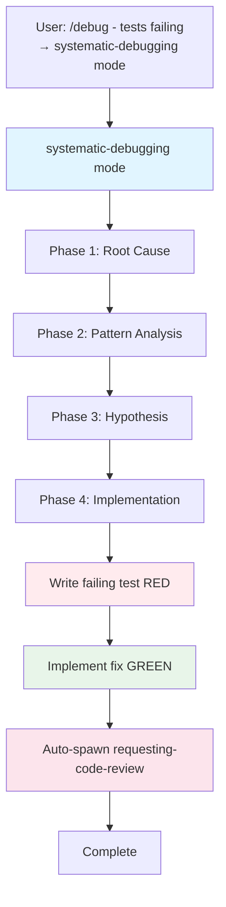
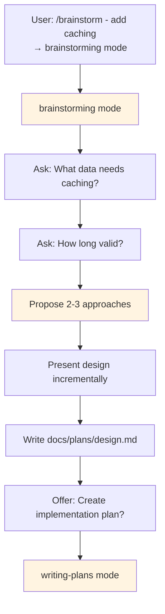

# SuperBob Architecture

**Technical documentation for the SuperBob development methodology implementation in IBM Bob**

---

## Overview

SuperBob adapts the [obra/superpowers](https://github.com/obra/superpowers) development methodology from Claude Code to IBM Bob. It preserves the core TDD/debugging/review discipline while adapting to IBM Bob's mode-based architecture.

**Architecture:** 21 skill-modes in IBM Bob

---

## System Components

SuperBob consists of three main components:

### 1. Custom Modes (21 Skill-Modes)

**File:** `custom_modes.yaml`

Skills from obra/superpowers, implemented as individual IBM Bob modes:

**Entry Point:**
- **using-superpowers** - Entry point that helps select the right skill

**Development Skills (7):**
- **test-driven-development** - RED-GREEN-REFACTOR cycle enforced
- **testing-anti-patterns** - Prevents testing mock behavior, test-only methods
- **verification-before-completion** - Evidence before any completion claims
- **condition-based-waiting** - Eliminates flaky tests with proper async handling
- **defense-in-depth** - Multi-layer validation makes bugs structurally impossible
- **receiving-code-review** - Process review feedback with technical rigor
- **requesting-code-review** - Perform rigorous code review

**Debugging Skills (3):**
- **systematic-debugging** - 4-phase root-cause investigation framework
- **root-cause-tracing** - Backward tracing through call stack to original trigger
- **dispatching-parallel-agents** - Spawn multiple independent investigations concurrently

**Planning & Architecture Skills (6):**
- **brainstorming** - Socratic design refinement with incremental validation
- **writing-plans** - Comprehensive implementation plans assuming zero context
- **executing-plans** - Batch execution with review checkpoints
- **subagent-driven-development** - Per-task subagent dispatch with review gates
- **using-git-worktrees** - Isolated workspace setup with safety verification
- **finishing-a-development-branch** - Complete development with merge/PR/cleanup options

**Meta & Workflow Skills (4):**
- **writing-skills** - Create new skills with TDD
- **testing-skills-with-subagents** - Validate skills work under pressure
- **sharing-skills** - Contribute improvements back upstream
- **using-superpowers** - (listed above as entry point)

### 2. Slash Commands (7 Commands)

**Directory:** `.bob/commands/`

Quick-access shortcuts for common workflows:

| Command | Mode Triggered | Purpose |
|---------|---------------|---------|
| `/tdd` | test-driven-development | Quick access to TDD workflow |
| `/debug` | systematic-debugging | Quick access to debugging framework |
| `/brainstorm` | brainstorming | Design refinement via Socratic method |
| `/write-plan` | writing-plans | Create comprehensive implementation plan |
| `/execute-plan` | executing-plans | Execute plan in batches with checkpoints |
| `/review` | requesting-code-review | Request rigorous code review |
| `/finish` | finishing-a-development-branch | Complete development (merge/PR/cleanup) |

### 3. Workspace Rules

**File:** `.bob/rules/superbob-workspace.md`

Global rule that enforces SuperBob methodology across all modes:

**Core Principles (Non-Negotiable):**
- 🔴 NO CODE WITHOUT FAILING TEST FIRST
- ✅ NO COMPLETION CLAIMS WITHOUT FRESH VERIFICATION
- 🔍 ROOT CAUSE INVESTIGATION BEFORE FIXES
- 👁️ REVIEW EARLY, REVIEW OFTEN

**Purpose:**
- Prevents mode bypass for convenience
- Maintains discipline across sessions
- Establishes non-negotiable standards

---

## Key Design Decisions

### One Mode Per Skill (1:1 Mapping)

**Decision:** Create 21 separate IBM Bob modes, one for each skill

**Rationale:**
- Maximum fidelity to original methodology (90%+)
- Clear mental model: "I'm using the TDD skill"
- Lighter context: Only active skill loaded
- Better skill composition: Skills invoke other skills via `new_task()`
- Easier to learn: One skill at a time vs. complex fat modes

**Trade-off:** More modes in dropdown, but clearer purpose for each

---

### Skill Composition via new_task()

**Decision:** Skills invoke other skills using IBM Bob's `new_task()` function

**Example:**
```
test-driven-development mode:
1. Implements feature using RED-GREEN-REFACTOR
2. AUTOMATICALLY spawns requesting-code-review mode
3. Review mode performs review, returns feedback
4. TDD mode addresses feedback if needed
```

**Benefits:**
- Skills compose naturally (like obra/superpowers)
- Isolated contexts for each subtask
- Clear delegation boundaries
- Automatic quality gates

---

### Auto-Trigger Code Review

**Decision:** Automatically spawn code review after implementation (no permission needed)

**Implementation:**
- test-driven-development mode → auto-spawns requesting-code-review
- systematic-debugging mode → auto-spawns requesting-code-review

**Benefits:**
- Structural enforcement (not just reminders)
- Catches issues before they compound
- Consistent quality gates
- No reliance on discipline alone

**Enhancement over obra/superpowers:** Original reminds to request review; SuperBob enforces it structurally

---

### Entry Point Mode (using-superpowers)

**Decision:** Create dedicated entry point mode that helps select the right skill

**Behavior:**
- Analyzes user's request
- Recommends appropriate skill-mode
- Spawns the selected skill
- Returns when skill completes

**Benefits:**
- Lowers barrier to entry (don't need to know all 20 skills)
- Ensures right skill for the task
- Teaches skill selection over time

---

## Installation Approaches

### Global Installation (Recommended)

Installs SuperBob for **all projects**:

**Windows:**
```powershell
copy custom_modes.yaml "$env:APPDATA\Code\User\settings\custom_modes.yaml"
xcopy /E /I .bob\rules "$env:APPDATA\Code\User\settings\rules"
xcopy /E /I .bob\commands "$env:APPDATA\Code\User\settings\commands"
```

**macOS/Linux:**
```bash
mkdir -p ~/.config/Code/User/settings
cp custom_modes.yaml ~/.config/Code/User/settings/custom_modes.yaml
cp -r .bob/rules ~/.config/Code/User/settings/
cp -r .bob/commands ~/.config/Code/User/settings/
```

**Result:** SuperBob available in every VS Code project

---

### Project-Specific Installation

Installs SuperBob for **one project only**:

```bash
cd your-project
cp /path/to/super-bob/custom_modes.yaml .
cp -r /path/to/super-bob/.bob .
```

**When to use:**
- Testing SuperBob modifications
- Project-specific customizations
- Team doesn't use SuperBob globally
- Different SuperBob version per project

**Note:** Project-specific overrides global settings

---

## Troubleshooting

Quick solutions to common SuperBob issues.

### Mode not appearing in dropdown

**Symptom:** IBM Bob mode selector doesn't show 21 SuperBob skill-modes

**Solution:**
1. Verify file location: `~/.config/Code/User/settings/custom_modes.yaml` (macOS/Linux) or `%APPDATA%\Code\User\settings\custom_modes.yaml` (Windows)
2. Restart VS Code completely (not just reload window)
3. Validate YAML: `python3 -c "import yaml; yaml.safe_load(open('custom_modes.yaml'))"`

### Slash commands don't work

**Symptom:** Typing `/tdd` or `/debug` doesn't trigger commands

**Solution:**
1. Check `.bob/commands/` directory exists with 7 .md files
2. Restart VS Code completely
3. Verify IBM Bob extension is active in VS Code extensions panel

### Wrong mode activates

**Symptom:** Selecting one mode activates a different one

**Solution:**
1. Check for duplicate slugs in `custom_modes.yaml` file
2. Project-specific `custom_modes.yaml` may override global settings
3. Remove project-specific `custom_modes.yaml` if not intended

### Auto-review not triggering

**Symptom:** test-driven-development completes without spawning requesting-code-review

**Solution:**
1. Verify mode has `new_task()` call in roleDefinition section
2. Check IBM Bob version supports `new_task()` (update if needed)
3. Review mode definition in `custom_modes.yaml` for syntax errors

### Skills don't compose (subtasks fail)

**Symptom:** Modes don't spawn other modes via `new_task()`

**Solution:**
1. Enable auto-approval for read operations in VS Code settings (speeds up subtasks)
2. Check IBM Bob console (View → Output → IBM Bob) for errors
3. Verify `custom_modes.yaml` doesn't have syntax errors

**Still having issues?**
- Check [GitHub Issues](https://github.ibm.com/ERANRA/super-bob/issues)
- File a new issue with: IBM Bob version, error messages, `custom_modes.yaml` content, steps to reproduce

---

## Workflow Examples

### Overview: All Workflows

This diagram shows how all SuperBob workflows relate and compose:



**Color Legend:**
- **Blue**: Entry points
- **Yellow**: Planning/Design
- **Green**: Implementation
- **Red**: Debugging
- **Pink**: Review
- **Purple**: Completion

---

### Example 1: Feature Implementation

**Visual workflow:**



**Detailed walkthrough:**

```
1. User: "Add user authentication"

2. using-superpowers mode (entry point):
   → Analyzes request
   → Selects brainstorming mode
   → Spawns brainstorming

3. brainstorming mode:
   → Refines design through Socratic questions
   → Presents 2-3 approaches with trade-offs
   → User approves design
   → Offers to create plan

4. writing-plans mode:
   → Creates detailed plan with TDD tasks
   → Saves to docs/plans/YYYY-MM-DD-auth.md
   → Offers to execute plan

5. executing-plans mode:
   → Spawns test-driven-development (Task 1)
   → TDD mode: RED → GREEN → REFACTOR
   → Auto-spawns requesting-code-review
   → Review completes, returns to executing-plans
   → Spawns test-driven-development (Task 2)
   → (repeat for all tasks)
   → All tasks complete

6. finishing-a-development-branch mode:
   → Verifies tests pass
   → Presents 4 options (merge/PR/keep/discard)
   → Executes user's choice
```

---

### Example 2: Quick Bug Fix

**Visual workflow:**



**Detailed walkthrough:**

```
1. User: "/debug - tests failing for empty email"

2. systematic-debugging mode:
   → Phase 1: Root cause investigation
     - Reproduces bug consistently
     - Checks recent changes
     - Traces data flow to find missing validation
   → Phase 2: Pattern analysis
     - Finds working validation examples
     - Compares differences
   → Phase 3: Hypothesis testing
     - Forms hypothesis: "Missing email validation in submitForm"
     - Tests minimally
   → Phase 4: Implementation
     - Creates failing test (RED)
     - Implements fix (GREEN)
     - Refactors
   → Auto-spawns requesting-code-review
   → Addresses review feedback
   → Complete
```

---

### Example 3: Design Refinement

**Visual workflow:**



**Detailed walkthrough:**

```
1. User: "/brainstorm - I want to add caching"

2. brainstorming mode:
   → Checks current project state
   → Asks: "What data needs caching?" (one question)
   → User: "API responses"
   → Asks: "How long should cache be valid?"
   → User: "5 minutes"
   → Proposes 2-3 approaches:
     - Option A: In-memory (simple, lost on restart)
     - Option B: Redis (persistent, needs infrastructure)
     - Option C: localStorage (client-side, size limits)
   → Recommends Option A for MVP
   → Presents design incrementally (200-300 words per section)
   → Writes design doc to docs/plans/
   → Offers to create implementation plan
```

---

## Fidelity to Original Superpowers

### Preserved (100% fidelity)

- ✅ Core skills preserved
- ✅ Core methodology (TDD, debugging, review)
- ✅ All workflows (brainstorming → planning → implementation)
- ✅ Discipline principles (test-first, verification, root-cause)
- ✅ Skill composition (skills invoke other skills)

### Adapted (Platform Differences)

- **Skill delivery:** Separate files → 21 IBM Bob modes
- **Subtask isolation:** Task tool (Claude Code) → new_task() (IBM Bob)
- **Mode selection:** Automatic skill loading → Mode dropdown + entry point

### Enhanced (SuperBob Improvements)

- ⭐ Auto-trigger code review (structural enforcement)
- ⭐ Entry point mode (using-superpowers)
- ⭐ Slash commands (quick access)
- ⭐ Global workspace rules (prevent bypass)

**Overall fidelity: 90%+** - Core methodology identical, optimizations for IBM Bob

---

## Technical Details

### Mode Definition Format

Each skill-mode is defined in `custom_modes.yaml`:

```yaml
customModes:
  - slug: skill-name
    name: Skill Display Name
    description: "Short description"
    roleDefinition: |
      # SKILL: SKILL NAME

      [Full skill content - methodology, workflow, examples]

      ## SKILL COMPOSITION
      [When and how this skill invokes other skills]

      ## COMPLETION CRITERIA
      [What "done" means for this skill]

      ## COMMUNICATION AND TOOL USAGE
      [Standard communication patterns]
    whenToUse: "When to use: [trigger conditions]"
    groups:
      - read      # Can read files
      - edit      # Can edit files
      - command   # Can run commands
    fileRegex: "**/*.md"  # Optional: limit edit to specific files
```

---

### Skill Composition Pattern

Skills compose using IBM Bob's `new_task()`:

```javascript
// In test-driven-development mode roleDefinition:
After reaching GREEN + refactored state:
- AUTOMATICALLY spawn code review:
  new_task(
    mode: "requesting-code-review",
    task: "Review implementation of [feature]. Check: requirements match,
           tests exist and test behavior, no bugs, follows patterns."
  )
```

**Execution:**
1. TDD mode implements feature
2. Spawns review mode via new_task()
3. Review mode activates, performs review
4. Review mode returns summary to TDD mode
5. TDD mode addresses feedback if needed
6. Task completes

---

## Comparison to Original Superpowers

| Aspect | Original (Claude Code) | SuperBob (IBM Bob) |
|--------|------------------------|---------------------|
| Core methodology | TDD, debugging, review | Identical ✅ |
| Skill count | 20 skills | 21 skill-modes ✅ |
| Skill files | Separate .md files | Modes (embedded in custom_modes.yaml) 🟡 |
| On-demand loading | Load skill when needed | Load mode when selected ✅ |
| Skill mental model | Skill-centric | Skill-centric ✅ |
| Agent independence | Task tool (isolated) | new_task() (IBM Bob) 🟡 |
| Skill composability | Skills invoke skills | Modes invoke modes ✅ |
| Auto skill detection | Automatic | Entry point mode 🟡 |
| Workflows | All workflows | All preserved ✅ |
| Auto-discipline | Behavioral reminders | Auto-trigger review ⭐ |

**Legend:**
- ✅ = Identical or equivalent
- 🟡 = Adapted for platform
- ⭐ = Enhancement

---

## Future Improvements

### When IBM Bob Adds More Features

Potential enhancements as IBM Bob evolves:

1. **True agent isolation:** If IBM Bob adds independent agent support (like MCP), upgrade from new_task() to truly isolated agents

2. **Dynamic skill loading:** If IBM Bob supports loading modes on-demand, could optimize for smaller initial load

3. **Skill discovery:** Enhanced skill search/filtering if mode count grows significantly

4. **Telemetry:** Track which skills are most used to inform future improvements

---

## Summary

SuperBob successfully brings the proven superpowers methodology to IBM Bob by:

1. **Preserving all skills** - Core methodology intact, plus Super-Roo exclusives
2. **Maintaining core discipline** - TDD, verification, review unchanged
3. **Adapting to IBM Bob** - Uses modes, new_task(), and IBM Bob conventions
4. **Adding structural enforcement** - Auto-trigger review, not just reminders
5. **Achieving 90%+ fidelity** - Maximum compatibility with original

**Result:** Battle-tested development methodology now available for IBM Bob users, with the same rigor and discipline as the original.

---

## References

- **Original superpowers:** [github.com/obra/superpowers](https://github.com/obra/superpowers)
