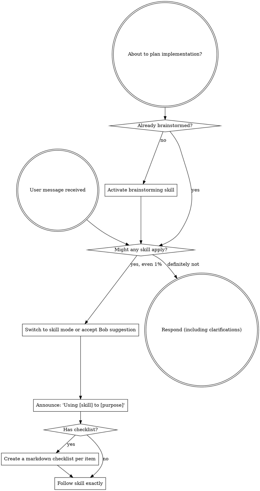

# Port Superpowers Skills to Bob Implementation Plan

> **For agentic workers:** REQUIRED SUB-SKILL: Use superpowers:subagent-driven-development (recommended) or superpowers:executing-plans to implement this plan task-by-task. Steps use checkbox (`- [ ]`) syntax for tracking.

**Goal:** Port all 14 upstream superpowers skills into IBM Bob's native SKILL.md format, replace fat custom_modes.yaml with 14 thin wrappers, add 7 missing slash commands, update install.sh, and add a sync script.

**Architecture:** Copy upstream skills verbatim where possible; apply a targeted sed patch for the 2 skills referencing `TodoWrite`; manually rewrite `using-superpowers` for Bob's skill-activation model. Modes become thin one-liner wrappers that activate the corresponding skill. A sync script replaces the 4 Python maintenance scripts.

**Tech Stack:** Bash, YAML, Markdown. Upstream source: `/home/eranra/go/src/github.com/obra/superpowers`

**Correction from design spec:** File audit showed only 1 skill needs a full rewrite (not 3), and 2 need patching (not 3). `using-git-worktrees` and `finishing-a-development-branch` are already platform-agnostic and go verbatim.

---

### Task 1: Create skills/ directory with 11 verbatim copies

**Files:**
- Create: `skills/brainstorming/SKILL.md`
- Create: `skills/dispatching-parallel-agents/SKILL.md`
- Create: `skills/finishing-a-development-branch/SKILL.md`
- Create: `skills/receiving-code-review/SKILL.md`
- Create: `skills/requesting-code-review/SKILL.md`
- Create: `skills/systematic-debugging/SKILL.md`
- Create: `skills/test-driven-development/SKILL.md`
- Create: `skills/using-git-worktrees/SKILL.md`
- Create: `skills/verification-before-completion/SKILL.md`
- Create: `skills/writing-plans/SKILL.md`
- Create: `skills/writing-skills/SKILL.md`

- [ ] **Step 1: Copy all 11 verbatim skills**

```bash
UPSTREAM=/home/eranra/go/src/github.com/obra/superpowers/skills
cd /home/eranra/go/src/github.com/eranra/super-bob

for skill in \
  brainstorming \
  dispatching-parallel-agents \
  finishing-a-development-branch \
  receiving-code-review \
  requesting-code-review \
  systematic-debugging \
  test-driven-development \
  using-git-worktrees \
  verification-before-completion \
  writing-plans \
  writing-skills; do
  mkdir -p "skills/$skill"
  cp "$UPSTREAM/$skill/SKILL.md" "skills/$skill/SKILL.md"
done
```

- [ ] **Step 2: Verify all 11 files exist and have content**

```bash
for skill in \
  brainstorming dispatching-parallel-agents finishing-a-development-branch \
  receiving-code-review requesting-code-review systematic-debugging \
  test-driven-development using-git-worktrees verification-before-completion \
  writing-plans writing-skills; do
  count=$(wc -l < "skills/$skill/SKILL.md")
  echo "$skill: $count lines"
done
```

Expected: each skill prints a line count > 0. No "No such file" errors.

- [ ] **Step 3: Commit**

```bash
git add skills/
git commit -m "feat: add 11 verbatim superpowers skills for Bob"
```

---

### Task 2: Create 2 patched skills (TodoWrite → markdown checklist)

**Files:**
- Create: `skills/executing-plans/SKILL.md`
- Create: `skills/subagent-driven-development/SKILL.md`

- [ ] **Step 1: Copy and patch executing-plans**

```bash
UPSTREAM=/home/eranra/go/src/github.com/obra/superpowers/skills
mkdir -p skills/executing-plans
sed \
  -e 's/Create TodoWrite and proceed/Create a markdown checklist and proceed/g' \
  "$UPSTREAM/executing-plans/SKILL.md" > skills/executing-plans/SKILL.md
```

- [ ] **Step 2: Verify the patch was applied**

```bash
grep -n "TodoWrite" skills/executing-plans/SKILL.md
```

Expected: no output (zero matches).

- [ ] **Step 3: Copy and patch subagent-driven-development**

```bash
mkdir -p skills/subagent-driven-development
sed \
  -e 's/Create TodoWrite and proceed/Create a markdown checklist and proceed/g' \
  -e 's/create TodoWrite/create a task checklist/g' \
  -e 's/Create TodoWrite/Create a task checklist/g' \
  -e 's/Mark task complete in TodoWrite/Mark task complete in the plan file/g' \
  -e 's/mark task complete in TodoWrite/mark task complete in the plan file/g' \
  "$UPSTREAM/subagent-driven-development/SKILL.md" > skills/subagent-driven-development/SKILL.md
```

- [ ] **Step 4: Verify the patch was applied**

```bash
grep -n "TodoWrite" skills/subagent-driven-development/SKILL.md
```

Expected: no output (zero matches).

- [ ] **Step 5: Commit**

```bash
git add skills/executing-plans/ skills/subagent-driven-development/
git commit -m "feat: add 2 TodoWrite-patched superpowers skills for Bob"
```

---

### Task 3: Write using-superpowers Bob adaptation

**Files:**
- Create: `skills/using-superpowers/SKILL.md`

- [ ] **Step 1: Write the Bob-adapted skill**

Create `skills/using-superpowers/SKILL.md` with this exact content:

```markdown
---
name: using-superpowers
description: Use when starting any conversation - establishes how to find and use skills, requiring skill activation before ANY response including clarifying questions
---

<SUBAGENT-STOP>
If you were dispatched as a subagent to execute a specific task, skip this skill.
</SUBAGENT-STOP>

<EXTREMELY-IMPORTANT>
If you think there is even a 1% chance a skill might apply to what you are doing, you ABSOLUTELY MUST activate the skill.

IF A SKILL APPLIES TO YOUR TASK, YOU DO NOT HAVE A CHOICE. YOU MUST USE IT.

This is not negotiable. This is not optional. You cannot rationalize your way out of this.
</EXTREMELY-IMPORTANT>

## Instruction Priority

Superpowers skills override default system prompt behavior, but **user instructions always take precedence**:

1. **User's explicit instructions** (AGENTS.md, direct requests) — highest priority
2. **Superpowers skills** — override default system behavior where they conflict
3. **Default system prompt** — lowest priority

If AGENTS.md says "don't use TDD" and a skill says "always use TDD," follow the user's instructions. The user is in control.

## How to Access Skills in IBM Bob

Skills activate in **Advanced mode**. Bob will suggest relevant skills automatically based on your task description.

**To activate a skill:**
- Switch to the corresponding mode (e.g., switch to "Test-Driven Development" mode)
- Use the slash command (e.g., `/tdd`)
- Accept Bob's skill suggestion when prompted
- Enable **Settings → Auto-Approve → Skills** to skip the approval prompt

**Available skills and their commands:**

| Skill | Command | When to use |
|---|---|---|
| `using-superpowers` | `/superpowers` | Starting any conversation |
| `brainstorming` | `/brainstorm` | Before any new feature or modification |
| `test-driven-development` | `/tdd` | Implementing features or bug fixes |
| `systematic-debugging` | `/debug` | Any bug, failure, or unexpected behavior |
| `writing-plans` | `/write-plan` | Planning a multi-step task |
| `executing-plans` | `/execute-plan` | Executing a written plan |
| `requesting-code-review` | `/review` | Completing tasks, before merging |
| `receiving-code-review` | `/receive-review` | Processing review feedback |
| `subagent-driven-development` | `/subagent` | Executing plans with per-task agents |
| `dispatching-parallel-agents` | `/dispatch` | 2+ independent tasks in parallel |
| `using-git-worktrees` | `/worktree` | Isolating feature work |
| `finishing-a-development-branch` | `/finish` | Completing a development branch |
| `verification-before-completion` | `/verify` | Before claiming work is done |
| `writing-skills` | `/write-skill` | Creating or editing skills |

# Using Skills

## The Rule

**Activate the relevant skill BEFORE any response or action.** Even a 1% chance a skill might apply means you should activate it. If an activated skill turns out to be wrong for the situation, you don't need to use it.



## Red Flags

These thoughts mean STOP—you're rationalizing:

| Thought | Reality |
|---------|---------|
| "This is just a simple question" | Questions are tasks. Check for skills. |
| "I need more context first" | Skill check comes BEFORE clarifying questions. |
| "Let me explore the codebase first" | Skills tell you HOW to explore. Check first. |
| "I can check git/files quickly" | Files lack conversation context. Check for skills. |
| "Let me gather information first" | Skills tell you HOW to gather information. |
| "This doesn't need a formal skill" | If a skill exists, use it. |
| "I remember this skill" | Skills evolve. Read current version. |
| "This doesn't count as a task" | Action = task. Check for skills. |
| "The skill is overkill" | Simple things become complex. Use it. |
| "I'll just do this one thing first" | Check BEFORE doing anything. |
| "This feels productive" | Undisciplined action wastes time. Skills prevent this. |
| "I know what that means" | Knowing the concept ≠ using the skill. Invoke it. |

## Skill Priority

When multiple skills could apply, use this order:

1. **Process skills first** (brainstorming, debugging) — determine HOW to approach the task
2. **Implementation skills second** — guide execution

"Let's build X" → brainstorming first, then implementation skills.
"Fix this bug" → debugging first, then domain-specific skills.

## Skill Types

**Rigid** (TDD, debugging): Follow exactly. Don't adapt away discipline.

**Flexible** (patterns): Adapt principles to context.

The skill itself tells you which.

## User Instructions

Instructions say WHAT, not HOW. "Add X" or "Fix Y" doesn't mean skip workflows.
```

- [ ] **Step 2: Verify the file has the correct frontmatter**

```bash
head -5 skills/using-superpowers/SKILL.md
```

Expected output:
```
---
name: using-superpowers
description: Use when starting any conversation - establishes how to find and use skills, requiring skill activation before ANY response including clarifying questions
---
```

- [ ] **Step 3: Verify no Skill-tool or TodoWrite references remain**

```bash
grep -n "Skill tool\|TodoWrite\|EnterPlanMode\|Copilot CLI\|Gemini CLI" skills/using-superpowers/SKILL.md
```

Expected: no output.

- [ ] **Step 4: Commit**

```bash
git add skills/using-superpowers/
git commit -m "feat: add Bob-adapted using-superpowers skill"
```

---

### Task 4: Replace custom_modes.yaml with 14 thin wrappers

**Files:**
- Modify: `custom_modes.yaml`

- [ ] **Step 1: Back up the existing file**

```bash
cp custom_modes.yaml custom_modes.yaml.bak
```

- [ ] **Step 2: Write the new 14-mode thin custom_modes.yaml**

Replace the full contents of `custom_modes.yaml` with:

```yaml
customModes:
- slug: using-superpowers
  name: Using Superpowers
  roleDefinition: >
    You are the entry point for superpowers workflows in IBM Bob.
    Activate the using-superpowers skill and follow it exactly.
  whenToUse: Use when starting any conversation to establish which skill applies.
  groups:
    - read
    - edit
    - command
    - skill

- slug: brainstorming
  name: Brainstorming
  roleDefinition: >
    You are a collaborative design partner helping explore ideas before implementation.
    Activate the brainstorming skill and follow it exactly.
  whenToUse: Use when starting any new feature, modification, or creative work.
  groups:
    - read
    - edit
    - browser
    - command
    - skill

- slug: test-driven-development
  name: Test-Driven Development
  roleDefinition: >
    You are a disciplined software engineer who writes tests before code.
    Activate the test-driven-development skill and follow it exactly.
  whenToUse: Use when implementing any feature or bug fix.
  groups:
    - read
    - edit
    - command
    - skill

- slug: systematic-debugging
  name: Systematic Debugging
  roleDefinition: >
    You are a methodical engineer who investigates root causes before proposing fixes.
    Activate the systematic-debugging skill and follow it exactly.
  whenToUse: Use when encountering any bug, test failure, or unexpected behavior.
  groups:
    - read
    - edit
    - command
    - skill

- slug: writing-plans
  name: Writing Plans
  roleDefinition: >
    You are a precise planner who writes comprehensive, bite-sized implementation plans.
    Activate the writing-plans skill and follow it exactly.
  whenToUse: Use when you have a spec or requirements for a multi-step task.
  groups:
    - read
    - edit
    - command
    - skill

- slug: executing-plans
  name: Executing Plans
  roleDefinition: >
    You are a disciplined executor who follows implementation plans task by task.
    Activate the executing-plans skill and follow it exactly.
  whenToUse: Use when you have a written implementation plan to execute.
  groups:
    - read
    - edit
    - command
    - skill

- slug: requesting-code-review
  name: Requesting Code Review
  roleDefinition: >
    You are a thorough code reviewer who checks work against requirements.
    Activate the requesting-code-review skill and follow it exactly.
  whenToUse: Use when completing tasks or implementing features to verify work meets requirements.
  groups:
    - read
    - edit
    - command
    - skill

- slug: receiving-code-review
  name: Receiving Code Review
  roleDefinition: >
    You are a developer who processes code review feedback with rigor and care.
    Activate the receiving-code-review skill and follow it exactly.
  whenToUse: Use when receiving code review feedback before implementing suggestions.
  groups:
    - read
    - edit
    - command
    - skill

- slug: subagent-driven-development
  name: Subagent-Driven Development
  roleDefinition: >
    You are an orchestrator who dispatches fresh agents per task with review checkpoints.
    Activate the subagent-driven-development skill and follow it exactly.
  whenToUse: Use when executing implementation plans with independent tasks.
  groups:
    - read
    - edit
    - command
    - skill

- slug: dispatching-parallel-agents
  name: Dispatching Parallel Agents
  roleDefinition: >
    You are a coordinator who fans out independent tasks across parallel agents.
    Activate the dispatching-parallel-agents skill and follow it exactly.
  whenToUse: Use when facing 2 or more independent tasks that can be worked on in parallel.
  groups:
    - read
    - edit
    - command
    - skill

- slug: using-git-worktrees
  name: Using Git Worktrees
  roleDefinition: >
    You are an engineer who creates isolated git workspaces for feature work.
    Activate the using-git-worktrees skill and follow it exactly.
  whenToUse: Use when starting feature work that needs isolation from the current workspace.
  groups:
    - read
    - edit
    - command
    - skill

- slug: finishing-a-development-branch
  name: Finishing a Development Branch
  roleDefinition: >
    You are a developer who completes branches with structured merge, PR, and cleanup options.
    Activate the finishing-a-development-branch skill and follow it exactly.
  whenToUse: Use when implementation is complete and you need to decide how to integrate the work.
  groups:
    - read
    - edit
    - command
    - skill

- slug: verification-before-completion
  name: Verification Before Completion
  roleDefinition: >
    You are a rigorous engineer who provides evidence before claiming work is complete.
    Activate the verification-before-completion skill and follow it exactly.
  whenToUse: Use before claiming work is complete, fixed, or passing.
  groups:
    - read
    - edit
    - command
    - skill

- slug: writing-skills
  name: Writing Skills
  roleDefinition: >
    You are a skill author who creates well-tested, deployable skills for Bob.
    Activate the writing-skills skill and follow it exactly.
  whenToUse: Use when creating new skills or editing existing ones.
  groups:
    - read
    - edit
    - command
    - skill
```

- [ ] **Step 3: Validate YAML syntax**

```bash
python3 -c "import yaml; yaml.safe_load(open('custom_modes.yaml')); print('YAML valid')"
```

Expected: `YAML valid`

- [ ] **Step 4: Verify mode count is exactly 14**

```bash
grep -c "^- slug:" custom_modes.yaml
```

Expected: `14`

- [ ] **Step 5: Remove backup and commit**

```bash
rm custom_modes.yaml.bak
git add custom_modes.yaml
git commit -m "refactor: replace fat modes with 14 thin skill-activating wrappers"
```

---

### Task 5: Add 7 new slash commands

**Files:**
- Create: `commands/dispatch.md`
- Create: `commands/receive-review.md`
- Create: `commands/subagent.md`
- Create: `commands/worktree.md`
- Create: `commands/superpowers.md`
- Create: `commands/verify.md`
- Create: `commands/write-skill.md`

- [ ] **Step 1: Create commands/dispatch.md**

```markdown
---
description: Coordinate 2+ independent tasks in parallel
---

Switch to dispatching-parallel-agents mode and follow the skill exactly.
```

- [ ] **Step 2: Create commands/receive-review.md**

```markdown
---
description: Process code review feedback with rigor before implementing suggestions
---

Switch to receiving-code-review mode and follow the skill exactly.
```

- [ ] **Step 3: Create commands/subagent.md**

```markdown
---
description: Execute an implementation plan task-by-task using fresh subagents
---

Switch to subagent-driven-development mode and follow the skill exactly.
```

- [ ] **Step 4: Create commands/worktree.md**

```markdown
---
description: Create an isolated git worktree for feature work
---

Switch to using-git-worktrees mode and follow the skill exactly.
```

- [ ] **Step 5: Create commands/superpowers.md**

```markdown
---
description: Show all available skills and activate skill-first workflow discipline
---

Switch to using-superpowers mode and follow the skill exactly.
```

- [ ] **Step 6: Create commands/verify.md**

```markdown
---
description: Provide evidence before claiming work is complete or passing
---

Switch to verification-before-completion mode and follow the skill exactly.
```

- [ ] **Step 7: Create commands/write-skill.md**

```markdown
---
description: Create or edit a Bob skill using the writing-skills workflow
---

Switch to writing-skills mode and follow the skill exactly.
```

- [ ] **Step 8: Verify 14 total command files exist**

```bash
ls commands/*.md | wc -l
```

Expected: `14`

- [ ] **Step 9: Commit**

```bash
git add commands/
git commit -m "feat: add 7 slash commands for remaining superpowers skills"
```

---

### Task 6: Update install.sh to install skills

**Files:**
- Modify: `install.sh`

- [ ] **Step 1: Add BOB_SKILLS variable at the top of install.sh**

After the line `BOB_RULES="$HOME/.bob/settings/rules"`, add:

```bash
BOB_SKILLS="$HOME/.bob/skills"
```

- [ ] **Step 2: Add skills installation section after the workspace rules section (step 3)**

After the block that ends with `echo "  + superbob-workspace.md"`, add:

```bash
# 4. skills
echo ""
echo "→ Installing skills → $BOB_SKILLS/"
run mkdir -p "$BOB_SKILLS"
shopt -s nullglob
for skill_dir in "$SCRIPT_DIR/skills/"/*/; do
  skill_name="$(basename "$skill_dir")"
  dest_dir="$BOB_SKILLS/$skill_name"
  if [[ -d "$dest_dir" ]] && ! $UPDATE_MODE; then
    echo "  ! Skipping $skill_name (already exists — use --update to reinstall)"
  else
    if [[ -d "$dest_dir" ]] && $UPDATE_MODE; then
      echo "  ↻ Updating $skill_name"
    else
      echo "  + $skill_name"
    fi
    run mkdir -p "$dest_dir"
    run cp "$skill_dir/SKILL.md" "$dest_dir/SKILL.md"
  fi
done
```

- [ ] **Step 3: Add skills verification section after the workspace rules check**

After the block that checks `superbob-workspace.md`, add:

```bash
# 4. Verify skills are installed
echo ""
echo "→ Checking skills..."
EXPECTED_SKILLS=(
  "brainstorming"
  "dispatching-parallel-agents"
  "executing-plans"
  "finishing-a-development-branch"
  "receiving-code-review"
  "requesting-code-review"
  "subagent-driven-development"
  "systematic-debugging"
  "test-driven-development"
  "using-git-worktrees"
  "using-superpowers"
  "verification-before-completion"
  "writing-plans"
  "writing-skills"
)
SKILLS_FOUND=0

for skill in "${EXPECTED_SKILLS[@]}"; do
  if [[ -f "$BOB_SKILLS/$skill/SKILL.md" ]]; then
    echo "  ✓ $skill"
    SKILLS_FOUND=$((SKILLS_FOUND + 1))
  else
    echo "  ✗ $skill (missing)"
    VERIFICATION_PASSED=false
  fi
done

echo "  Found $SKILLS_FOUND of ${#EXPECTED_SKILLS[@]} skills"
```

- [ ] **Step 4: Update EXPECTED_COMMANDS array to include all 14 commands**

Replace:
```bash
EXPECTED_COMMANDS=("brainstorm.md" "debug.md" "execute-plan.md" "finish.md" "review.md" "tdd.md" "write-plan.md")
```

With:
```bash
EXPECTED_COMMANDS=(
  "brainstorm.md"
  "debug.md"
  "dispatch.md"
  "execute-plan.md"
  "finish.md"
  "receive-review.md"
  "review.md"
  "subagent.md"
  "superpowers.md"
  "tdd.md"
  "verify.md"
  "worktree.md"
  "write-plan.md"
  "write-skill.md"
)
```

- [ ] **Step 5: Update the Next Steps section to mention skills**

Replace:
```bash
echo "  1. Restart IBM Bob to load the new modes"
```

With:
```bash
echo "  1. Restart IBM Bob to load the new modes and skills"
```

Add after the existing step 2 (`/tdd`):
```bash
echo "  2. Try: /superpowers to see all available skills"
```

- [ ] **Step 6: Run the existing test suite to verify nothing broke**

```bash
bash tests/test_install.sh
```

Expected: `✓ All tests passed!`

- [ ] **Step 7: Run a dry-run of install to verify new skills section output**

```bash
bash install.sh --dry-run 2>&1 | grep -A 20 "Installing skills"
```

Expected: output showing `→ Installing skills → ...` followed by `[dry-run]` lines for each of the 14 skills.

- [ ] **Step 8: Commit**

```bash
git add install.sh
git commit -m "feat: update install.sh to install skills to ~/.bob/skills/"
```

---

### Task 7: Create sync-from-upstream.sh

**Files:**
- Create: `sync-from-upstream.sh`

- [ ] **Step 1: Write the sync script**

Create `sync-from-upstream.sh` with:

```bash
#!/usr/bin/env bash
# Sync superpowers skills from upstream obra/superpowers.
# Usage: ./sync-from-upstream.sh [path-to-upstream]
set -euo pipefail

UPSTREAM="${1:-/home/eranra/go/src/github.com/obra/superpowers}"
SCRIPT_DIR="$(cd "$(dirname "${BASH_SOURCE[0]}")" && pwd)"
SKILLS_DIR="$SCRIPT_DIR/skills"

if [[ ! -d "$UPSTREAM/skills" ]]; then
  echo "Error: upstream skills directory not found at $UPSTREAM/skills"
  echo "Usage: $0 [path-to-upstream]"
  exit 1
fi

echo "=== Syncing from upstream: $UPSTREAM ==="
echo ""

# 11 skills copied verbatim
VERBATIM_SKILLS=(
  brainstorming
  dispatching-parallel-agents
  finishing-a-development-branch
  receiving-code-review
  requesting-code-review
  systematic-debugging
  test-driven-development
  using-git-worktrees
  verification-before-completion
  writing-plans
  writing-skills
)

# 2 skills with TodoWrite → markdown checklist patch
PATCHED_SKILLS=(
  executing-plans
  subagent-driven-development
)

# 1 skill that is a Bob-specific rewrite — never overwritten by sync
MANUAL_SKILLS=(
  using-superpowers
)

echo "→ Copying verbatim skills..."
for skill in "${VERBATIM_SKILLS[@]}"; do
  src="$UPSTREAM/skills/$skill/SKILL.md"
  dest="$SKILLS_DIR/$skill/SKILL.md"
  if [[ ! -f "$src" ]]; then
    echo "  ! WARNING: $skill/SKILL.md not found in upstream — skipping"
    continue
  fi
  mkdir -p "$SKILLS_DIR/$skill"
  cp "$src" "$dest"
  echo "  ✓ $skill"
done

echo ""
echo "→ Copying and patching TodoWrite skills..."
for skill in "${PATCHED_SKILLS[@]}"; do
  src="$UPSTREAM/skills/$skill/SKILL.md"
  dest="$SKILLS_DIR/$skill/SKILL.md"
  if [[ ! -f "$src" ]]; then
    echo "  ! WARNING: $skill/SKILL.md not found in upstream — skipping"
    continue
  fi
  mkdir -p "$SKILLS_DIR/$skill"
  sed \
    -e 's/Create TodoWrite and proceed/Create a markdown checklist and proceed/g' \
    -e 's/create TodoWrite/create a task checklist/g' \
    -e 's/Create TodoWrite/Create a task checklist/g' \
    -e 's/Mark task complete in TodoWrite/Mark task complete in the plan file/g' \
    -e 's/mark task complete in TodoWrite/mark task complete in the plan file/g' \
    "$src" > "$dest"
  echo "  ✓ $skill (patched)"
done

echo ""
echo "→ Skipping Bob-specific rewrites (manual review required):"
for skill in "${MANUAL_SKILLS[@]}"; do
  echo "  ~ $skill"
  echo "    Check upstream for changes: $UPSTREAM/skills/$skill/SKILL.md"
  echo "    Apply relevant changes manually to: $SKILLS_DIR/$skill/SKILL.md"
done

echo ""
echo "=== Sync complete. Changes: ==="
echo ""
git -C "$SCRIPT_DIR" diff --stat 2>/dev/null || echo "(not a git repo or no changes)"
```

- [ ] **Step 2: Make the script executable**

```bash
chmod +x sync-from-upstream.sh
```

- [ ] **Step 3: Run the sync script to verify it works**

```bash
./sync-from-upstream.sh
```

Expected output includes:
- `✓ brainstorming` through `✓ writing-skills` (11 verbatim)
- `✓ executing-plans (patched)` and `✓ subagent-driven-development (patched)` (2 patched)
- `~ using-superpowers` with reminder message (1 manual)
- `=== Sync complete` and a git diff stat showing 0 changes (since files were already written in Tasks 1-2)

- [ ] **Step 4: Verify no TodoWrite remains in patched skills after sync**

```bash
grep -rn "TodoWrite" skills/executing-plans/ skills/subagent-driven-development/
```

Expected: no output.

- [ ] **Step 5: Commit**

```bash
git add sync-from-upstream.sh
git commit -m "feat: add sync-from-upstream.sh to replace Python update scripts"
```

---

### Task 8: Remove Python update scripts

**Files:**
- Delete: `update_modes.py`
- Delete: `update_all_modes.py`
- Delete: `update_tdd_mode.py`
- Delete: `fix_remaining_modes.py`

- [ ] **Step 1: Verify the files are untracked (not in git history)**

```bash
git ls-files update_modes.py update_all_modes.py update_tdd_mode.py fix_remaining_modes.py
```

Expected: no output (files were never committed).

- [ ] **Step 2: Delete the files**

```bash
rm -f update_modes.py update_all_modes.py update_tdd_mode.py fix_remaining_modes.py
```

- [ ] **Step 3: Verify they are gone**

```bash
ls *.py 2>/dev/null && echo "ERROR: py files still present" || echo "OK: no .py files remain"
```

Expected: `OK: no .py files remain`

- [ ] **Step 4: Confirm git status is clean (no staged changes from deletions)**

```bash
git status --short
```

Expected: no lines for the deleted files (they were untracked, so deletion produces no git output).

- [ ] **Step 5: Final end-to-end verification**

```bash
# Count total skills
echo "Skills: $(ls skills/ | wc -l) (expected 14)"

# Count total commands
echo "Commands: $(ls commands/*.md | wc -l) (expected 14)"

# Count total modes
echo "Modes: $(grep -c '^- slug:' custom_modes.yaml) (expected 14)"

# Run install tests
bash tests/test_install.sh
```

Expected:
```
Skills: 14 (expected 14)
Commands: 14 (expected 14)
Modes: 14 (expected 14)
✓ All tests passed!
```

- [ ] **Step 6: Confirm git status is clean**

```bash
git status --short
```

Expected: no output, or only untracked/modified files unrelated to Python scripts. The deleted scripts were gitignored, so git records nothing from their removal.
